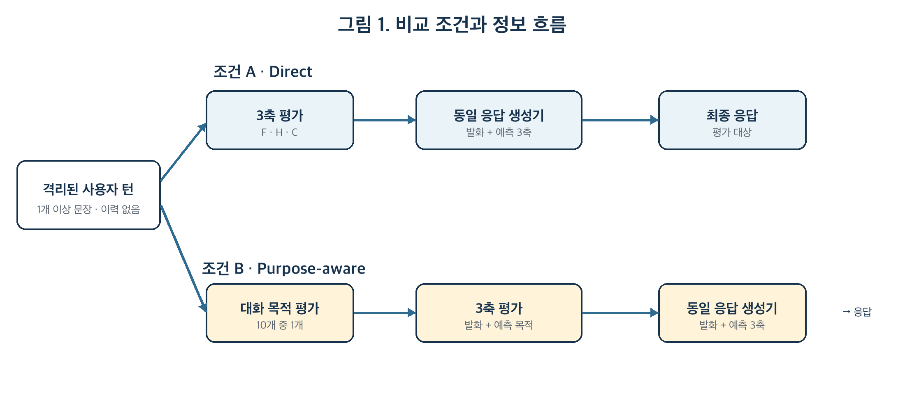
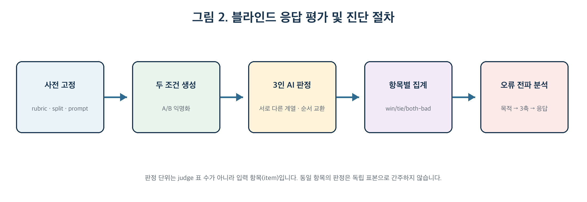

# Pally 대화 목적 선행형 3축 평가 및 응답 생성 실험 설계서

> 중의적·비격식 사용자 턴에서 계층적 중간 표현의 효과를 검증하는 파일럿 연구

- **문서 상태:** 논문용 연구계획
- **기준 Rubric:** Pally 측정 Rubric v2.2
- **대상 축:** Formality · Humor · Curiosity
- **기준일:** 2026-09-22

## 연구 설계 요약

본 연구는 사용자 발화의 Formality·Humor·Curiosity를 곧바로 추정해 응답을 생성하는 직접 조건과, 먼저 현재 사용자 턴의 대화 목적을 분류한 뒤 그 목적을 조건으로 세 축을 추정하고 응답을 생성하는 계층 조건을 비교합니다. 연구 대상은 단일 문장이 아니라 “대화 이력과 분리된 현재 사용자 턴”이며, 한 턴 안에는 의미 해석에 필요한 복수 문장이 포함될 수 있습니다.

독립변수는 대화 목적 중간 표현의 도입 여부이고, 주 결과는 최종 응답의 연구자 정의 정답 명세 부합도입니다. 세 축 점수와 대화 목적 정확도는 원인 진단을 위한 과정 지표입니다. 따라서 연구 결과는 단순한 모델 업데이트 전후 성능이 아니라, 명시적 의사소통 기능 표현이 중의적·비격식 표현을 포함한 응답 생성 과정에 주는 증분 효과와 오류 전파 구조를 설명합니다.

| 구분 | 확정 설계 |
| --- | --- |
| 분석 단위 | 이전·다음 턴이 없는 현재 사용자 턴. 턴 내부 복수 문장은 허용 |
| 조건 A | 사용자 턴 → Formality/Humor/Curiosity → 응답 |
| 조건 B | 사용자 턴 → 대화 목적(10종) → 목적을 입력받은 3축 평가 → 응답 |
| 주 결과 | 익명화된 A/B 응답의 쌍대 선호와 정답 명세 부합도 |
| 진단 결과 | 목적 macro-F1, 축별 MAE·Spearman, 중대한 의미 오해율, 오류 전파 |
| 범위 | Energy·Intimacy 제외(null), v1.0·pseudo-label 제외, v2.2 human final label 사용 |
| 평가자 | 서로 다른 계열의 LLM judge 3개 + 순서 교환; item 단위 합의 집계 |
| 주장 한계 | 인간 선호의 직접 검증이 아니라 연구자 정의 기준에 대한 자동 심사의 일치도 평가 |

> **연구 질문의 한 문장 버전**
>
> “현재 사용자 턴의 대화 목적을 명시적 중간 표현으로 사용하면, 직접 3축 평가만 사용하는 조건보다 중의적·비격식 표현의 의미를 보존하면서 더 적절한 응답을 생성하는가?”

## 1. 연구 배경과 문제 정의

Pally의 목표는 사용자 발화에서 관찰되는 스타일을 측정하고 그 결과를 응답 생성에 활용하는 것입니다. 그러나 현재 프로젝트의 기존 weak/pseudo label은 인간이 지각한 스타일을 보장하지 않으며, human_spoken=true 역시 입력을 인간이 말했다는 출처 표지일 뿐 human label을 뜻하지 않습니다. 따라서 본 실험은 새 인간 라벨을 기준으로 하며, 기존 v1.0과 rule/LLM pseudo-label을 주 분석의 학습 정답에서 제외합니다.

중의적 속어와 비격식 표현은 표면 단어만으로 의미를 확정하기 어렵습니다. Pei et al. (2019)은 속어를 문장 수준으로 탐지하고 토큰 수준으로 식별하는 과제를 분리했으며, 토큰 식별 성능이 더 낮아 맥락 의존적 의미 이동의 난점을 보였습니다. Sun et al. (2022)은 속어 해석에 문맥과 의미 적합성을 함께 사용했습니다. 본 연구는 속어 해석 모델을 재현하지는 않지만, “you ate”와 “I ate spaghetti”처럼 같은 단어가 현재 턴 안에서 다른 기능과 의미를 갖는 경우를 포함합니다.

대화 목적은 발화가 상대에게 요구하는 반응을 요약하는 중간 표현입니다. 대화행위 연구는 발화의 의사소통 기능을 대화 모델링의 유용한 단위로 다뤄 왔습니다(Stolcke et al., 2000). 본 연구는 이를 Pally에 맞춘 10개 대화 목적 범주로 조작화하고, 목적이 Pally에서 사용자 맞춤형 대화에 사용하는 세 축 점수와 응답 생성 사이에서 실제로 사용될 때 발생하는 차이를 검증합니다.

> **연구 공백**
>
> 선행연구는 대화행위 분류, 속어 탐지·해석, 자동 생성 평가를 각각 다루지만, 사용자를 위한 대화를 생성하는 입장에서 대화 목적을 검증하는 과정이 향후 대화 맥락에 있어 속어의 의미를 보존하는 결과에 도움이 되는지는 별도로 검증되지 않았습니다.

## 2. 연구 목적, 질문 및 가설

### 2.1 연구 목적

명시적 대화 목적을 중간 표현으로 추가하는 것이 최종 응답 품질에 주는 효과를 검증하고, 목적 분류의 성공·실패가 Formality·Humor·Curiosity 추정과 응답 오류에 연결되는 경로를 분석합니다. 이 설계는 “업데이트 후 좋아졌다”는 서술을 피하고, 두 조건 사이의 유일한 구조 차이를 통해 설명 가능한 비교를 만듭니다.

### 2.2 연구 질문

| ID | 연구 질문 |
| --- | --- |
| RQ1 | 대화 목적 선행 조건(B)은 직접 3축 조건(A)보다 연구자 정의 응답 명세에 더 부합하는 최종 응답을 생성하는가? |
| RQ2 | 그 효과는 중의적·비격식 표현 및 표면 단서 shortcut 사례에서 명확한 표현보다 크게 나타나는가? |
| RQ3 | 대화 목적 분류의 정확성은 축별 오차와 최종 응답의 중대한 의미 오해율에 어떻게 연결되는가? |
*단서 shortcut 사례: 특정 단어나 기호를 보고 AI가 단정지어 오답을 판정하는 상황

### 2.3 사전 등록 가설

| ID | 가설 | 판정 기준 |
| --- | --- | --- |
| H1 | 조건 B의 쌍대 승률이 조건 A보다 높다. | 동률 제외 exact sign/binomial test, 95% CI |
| H2 | 조건 B는 중대한 의미 오해율이 더 낮다. | 항목별 paired difference 및 bootstrap CI |
| H3 | B의 개선 폭은 ambiguous/informal·surface-shortcut 슬라이스에서 clear 슬라이스보다 크다. | 슬라이스별 효과와 상호작용 탐색 |

H3은 표본이 작은 파일럿에서는 탐색적 결과로 해석합니다. 효과가 유의하지 않더라도 신뢰구간과 오류 유형을 함께 보고하며, 영가설 수용이나 보편적 무효를 주장하지 않습니다.

## 3. 이론적 근거와 연구 기여

| 설계 요소 | 학술적 근거 | Pally에서의 적용 |
| --- | --- | --- |
| 대화 목적 중간 표현 | 대화행위는 발화의 의사소통 기능을 모델링하는 단위(Stolcke et al., 2000) | 목적을 10종으로 먼저 추정하고 B의 3축 입력에 실제로 제공 |
| 중의적 비격식 슬라이스 | 속어는 문장 탐지와 토큰 식별 난도가 다르고, 문맥·의미 적합성이 필요(Pei et al., 2019; Sun et al., 2022) | 단어 자체가 아니라 현재 턴 전체에서 의미와 기능을 판정 |
| 주관 라벨의 명시적 규약 | 주관 과제는 규범적 합의와 관점 다양성을 구분해야 함(Röttger et al., 2022) | v2.2의 prescriptive rubric을 고정하되 원시 평가와 불일치를 보존 |
| 행동 슬라이스 평가 | 단일 평균 점수는 특정 능력 실패를 가릴 수 있음(Ribeiro et al., 2020) | clear / ambiguous informal / surface shortcut을 별도 보고 |
| LLM judge와 통제 | LLM 평가는 구조화된 NLG 평가에 유용하나 편향이 존재(Liu et al., 2023; Zheng et al., 2023) | 익명화, 순서 교환, 타 계열 judge, 길이 통제, 항목 단위 집계 |
| 표본 불확실성 | 작은 샘플의 품질 추정은 불확실성이 큼(Klie et al., 2024) | 점 추정치와 95% CI를 함께 보고, N≈50은 파일럿으로 제한 |

### 3.1 예상 기여

1. 구조적 기여: 직접 3축 평가와 달리, 대화 목적을 세 축 평가의 입력으로 사용하는 계층형 측정·응답 경로를 제안함
3. 진단적 기여: 물음표, please, 속어 같은 표면 단서가 축 점수로 직결되는 shortcut 오류와 목적 오분류의 전파를 슬라이스별로 제시합니다.
4. 실무적 기여: Pally의 운영 경로와 분리된 재현 가능한 실험 경로, 데이터 필드, split, 자동 심사 규칙을 명세합니다.


## 4. 변수와 분석 단위

| 구분 | 정의 | 운영 방식 |
| --- | --- | --- |
| 독립변수 | 대화 목적 중간 표현 사용 여부 | A=없음, B=목적 예측 후 3축 입력에 사용 |
| 주 종속변수 | 최종 응답의 상대적 적합성 | 블라인드 A/B 쌍대 판정과 4개 하위 점수 |
| 과정 종속변수 | 목적·3축 측정 정확도 | 목적 macro-F1, 축 MAE·Spearman |
| 오류 종속변수 | 의미 및 기능 손상 | 중대한 의미 오해, 부적절한 톤, 무관 응답 비율 |
| 분석 단위 | 격리된 현재 사용자 턴 | 한 턴 내 1개 이상 문장 허용; 과거·미래 턴 미사용 |
| 통제변수 | 모델·학습·생성 조건 | 같은 checkpoint, split, compute, prompt 틀, 길이, decoding |
| 제외 축 | Energy, Intimacy | 각각 원음과 관계 이력이 없어 null |

> **용어 주의**
>
> “대화 목적”은 장기적인 대화 목표가 아니라 현재 사용자 턴이 상대에게 주로 요구하는 반응의 종류입니다. “중의적 표현 개선” 역시 토큰 하나의 뜻 맞히기가 아니라, 그 표현을 포함한 턴 전체에 대한 응답이 의도와 의미를 보존하는지를 뜻합니다.

## 5. 실험 조건



### 5.1 조건 A — Direct

사용자 턴만 입력하여 Formality·Humor·Curiosity를 예측합니다. 응답 생성기는 사용자 턴과 세 예측 점수만 받습니다. 대화 목적 라벨은 학습·추론 어느 단계에도 제공하지 않습니다.

### 5.2 조건 B — Purpose-aware hierarchical

사용자 턴에서 10개 중 하나의 대화 목적을 먼저 예측합니다. 다음 3축 평가기는 사용자 턴과 예측된 목적을 함께 입력받습니다. 응답 생성기는 조건 A와 동일하게 사용자 턴과 세 예측 점수만 받습니다. 이 제한은 목적이 응답에 미치는 효과가 3축 경로를 통해 발생하도록 하기 위한 것입니다.

> **필수 조작 점검**
>
> B가 목적을 출력만 하고 3축 평가에 사용하지 않으면 실험 조작이 성립하지 않습니다. 목적을 응답 생성기에 직접 넣는 경우에는 “목적이 3축을 통해 작동한다”는 주장을 할 수 없고, 연구 질문을 더 넓은 purpose-aware pipeline 효과로 바꾸어야 합니다.

### 5.3 두 조건에서 같은 요소

- 기반 모델 또는 checkpoint, tokenizer, 학습률, epoch/step, batch, seed, compute budget
- train/dev/final-test 항목과 전처리, 응답 생성 모델 및 시스템 프롬프트 틀
- temperature, top-p, 최대 길이, stop 조건, 출력 언어와 응답 길이 상한
- v2.2 축 정의, 정답 응답 명세, 평가 judge prompt와 집계 규칙


## 6. 대화 목적 평가와 3축 조작화

### 6.1 대화 목적 10종

| 코드 | 한국어명 | 판정 질문 |
| --- | --- | --- |
| inform_describe | 사실·상황 전달 | 무엇이 일어났거나 어떤 상태인지 알리는가? |
| self_disclose | 개인 경험·상태 공유 | 자신의 경험·감정·상태를 공유하는가? |
| opinion_evaluate | 의견·평가 | 대상에 대한 판단이나 평가를 제시하는가? |
| ask_fact_meaning | 사실·정의 질문 | 정답 범위가 비교적 한정된 사실·뜻을 묻는가? |
| ask_explain_explore | 설명·탐색 질문 | 이유·원리·비교·가능성을 넓혀 묻는가? |
| confirm_clarify | 확인·명료화 | 이해나 선택, 들은 내용을 확인하는가? |
| request_direct | 요청·지시·제안 | 상대의 행동을 요구하거나 제안하는가? |
| social_phatic | 인사·관계 유지 | 정보보다 사회적 연결과 대화 지속이 중심인가? |
| answer_acknowledge | 답변·동의·백채널 | 앞선 말에 답하거나 수용·청취를 표시하는가? |
| express_react | 감정·즉각 반응 | 놀람·기쁨·불만·감탄을 주로 표현하는가? |

joke/humorous/playful은 목적 범주로 두지 않습니다. Humor 정답을 중간 단계에 미리 포함하는 순환 판단을 막기 위해서입니다. 복합 목적이 있더라도 주 분석에서는 상대에게 요구하는 핵심 반응을 기준으로 primary 하나를 선택하고, secondary와 function_ambiguous는 진단 메타데이터로 보존합니다.

### 6.2 세 축

| 축 | 본 실험의 정의 | 금지되는 shortcut |
| --- | --- | --- |
| Formality | 현재 턴의 구어적 존중·체면 고려, 직접성 완화, 구어 register | please, 문장 길이, 문법 정확성만으로 상승시키지 않음 |
| Humor | 현재 턴에서 지각되는 유희적 프레이밍, 비문자성·불일치, 검수된 밈·슬랭의 유희적 사용 | 슬랭 출현이나 문법 오류만으로 상승시키지 않음 |
| Curiosity | 현재 턴이 정보·설명·관점·가능성을 얼마나 명시적으로 요구하는지 | 물음표 또는 질문형만으로 높은 점수를 부여하지 않음 |

세 축은 각각 0–100점이며 v2.2의 구성요소 가중치와 5점 단위 반올림을 유지합니다. 세 축의 합산 점수는 만들지 않습니다. Energy와 Intimacy는 0이 아니라 null로 저장합니다.

## 7. 데이터 구성과 라벨링

### 7.1 항목 구성

| 슬라이스 | 목적 | 예시·포함 기준 | 권장 비율 |
| --- | --- | --- | --- |
| clear | 기본 수행 확인 | 의미와 기능이 표면적으로 명확한 턴 | 약 40% |
| ambiguous_informal | 중의적 비격식 표현 해석 | ate, cooked, dead, sick 등 문자·비문자 해석 가능 사례 | 약 35% |
| surface_shortcut | 표면 단서 오류 진단 | please가 있으나 강압적 요청, 물음표가 있으나 수사 질문, 슬랭 인용·정의 질문 | 약 25% |

비율은 표본을 구성하기 위한 사전 목표이며 학계가 확정한 보편적 분포가 아닙니다. 같은 핵심 표현이나 템플릿의 변형은 lexical family로 묶어 split 간 이동을 금지합니다.

### 7.2 인간 정답 생성

1. 평가자는 출처, 모델 점수, 다른 평가자의 결과를 보지 않고 무작위 순서로 독립 평가합니다.
2. 각 항목에 primary dialogue purpose, Formality/Humor/Curiosity 점수, case_type, confidence, 짧은 근거를 기록합니다.
3. 응답 정답은 하나의 문장만 두지 않고 reference_response, required_properties, forbidden_errors를 함께 작성합니다. 표현이 달라도 요구 속성을 충족하면 정답으로 인정합니다.
4. 최소 20%를 이중 라벨링하되, 연구용 핵심 final-test는 가능하면 전 항목을 2인 이상 독립 평가합니다. 합의본과 원시 라벨을 모두 보존합니다.
5. 과도한 exact agreement가 나타나면 독립성을 확인할 때까지 보류하며 특정 평가자의 부정행위를 단정하지 않습니다.

주관 과제에서 단일 합의 정답만 저장하면 관점 차이가 사라질 수 있습니다. Röttger et al. (2022)의 구분을 따라 본 실험은 고정 rubric에 따른 규범적 라벨을 사용하되, 원시 라벨·근거·불일치를 함께 보존합니다. LLM 제안을 인간 평가자에게 노출하면 라벨 분포와 후속 평가가 이동할 수 있으므로 라벨 작성 단계에서는 AI 제안을 숨깁니다(Schroeder et al., 2025).

### 7.3 권장 데이터 필드

| 필드군 | 필드 | 역할 |
| --- | --- | --- |
| 식별·그룹 | item_id, lexical_family_id, source_id | 중복 방지와 grouped split |
| 입력 | target_turn, sentence_count, language_form | 격리된 턴 원문과 형식 상태 |
| 목적 정답 | purpose_primary, purpose_secondary, purpose_ambiguous | 10종 목적 및 모호성 |
| 축 정답 | formality, humor, curiosity, energy=null, intimacy=null | v2.2 측정값 |
| 상태 | case_type, score_status, confidence | clear/boundary/context_insufficient와 확정 여부 |
| 근거 | axis_rationale, purpose_rationale | 감사 가능한 짧은 판정 근거 |
| 응답 명세 | reference_response, required_properties, forbidden_errors | 표현 다양성을 허용하는 정답 기준 |
| 출처 | label_source, annotator_id_hash, rubric_version | human/pseudo 구분과 추적성 |
| 분할 | split, fold_id | 누출 없는 학습·검증·최종 평가 |

### 7.4 학습 포함 원칙

| 라벨 상태 | 3축 학습 | 목적 학습 | 용도 |
| --- | --- | --- | --- |
| human final · clear | 1.0 | 1.0 | 주 학습 및 평가 |
| human final · boundary | 1.0 | 1.0 | 핵심 경계 사례; 임의 감량하지 않음 |
| context_insufficient · provisional | 0.0 | 목적이 확정이면 1.0 | 진단용 보존; 축 회귀 제외 |
| LLM/rule pseudo-label | 0.0 | 0.0 | human-grounded 주 실험 제외 |
| v1.0 label | 0.0 | 0.0 | 정의가 달라 본 비교에서 폐기 |

기존의 복잡한 case_type 학습 가중치 표는 사용하지 않습니다. case_type은 주로 진단 슬라이스이며 별도 분류 target으로 학습할 때만 그 목적과 가중치를 사전 고정합니다.

## 8. Split 및 표본 규모

### 8.1 누출 방지 원칙

동일 문장 변형, 동일 핵심 표현, 동일 템플릿, 같은 수집 세션·화자에서 나온 항목은 하나의 연결 그룹으로 묶습니다. 한 그룹은 train/dev/final-test 중 하나에만 배정합니다. “you ate”, “she ate”, “you totally ate”처럼 표면만 바뀐 변형이 서로 다른 split에 들어가면 모델이 의미 규칙 대신 템플릿을 기억할 수 있습니다.

### 8.2 규모별 권장안

| 가용 항목 | 권장 설계 | 해석 |
| --- | --- | --- |
| N ≥ 100 | 그룹 단위 60/20/20 또는 70/15/15, final-test는 100–200개로 확대 | dev에서 결정한 뒤 final-test 1회 평가 |
| N ≈ 50 | grouped stratified 5-fold cross-validation, 각 항목의 out-of-fold 예측 비교 | 파일럿/타당성 연구; 일반화 주장 제한 |
| 향후 확장 | 80–120개 double-annotated calibration anchor + 별도 untouched final 100–200 | human-grounded 모델 진단과 최종 검증 분리 |

> **N=50일 때의 결론 범위**
>
> 50개로 실험은 가능하지만 “대화 목적 중간 표현이 일반적으로 우수하다”는 결론에는 부족합니다. 효과크기와 신뢰구간, 항목별 오류를 보고하는 파일럿으로 명시하고, 최종 검증용 자료는 별도로 남겨야 합니다.

## 9. 구현 절차

1. Rubric v2.2, 10개 목적 정의, 데이터 제외 기준, split group, 모델·생성·judge 설정을 사전 고정합니다.
2. 독립 인간 라벨과 응답 정답 명세를 생성하고, 목적·축 일치도와 비정상적 exact agreement를 점검합니다.
3. 조건 A와 B를 같은 초기 checkpoint와 같은 split으로 학습합니다. B의 목적 예측값이 다음 3축 입력에 실제로 연결되는지 로그로 확인합니다.
4. held-out(평가용 발화) 항목에서 목적·축·응답을 생성합니다. 응답 생성 시 과거 대화 이력을 전달하지 않습니다.
5. A/B 응답을 무작위 익명화하고, 연구자가 A→B와 B→A 순서로 모두 blind 평가합니다.
6.  item 단위로 승/동률/둘 다 부적합을 집계하고, 목적 오류 → 축 오류 → 응답 오류의 사례 연결표를 작성합니다.
    예시:
    | 항목 | 목적 정답 | B 목적 예측 | 축 오류 | A/B 결과 | 오류 설명 |
    |---|---|---|---|---|---|
    | 001 | 칭찬 | 음식 섭취 진술 | Humor 과소평가 | A 승 | `ate`의 비격식 의미를 놓침 |
    | 002 | 정보 질문 | 정보 질문 | 큰 오류 없음 | B 승 | 질문 목적에 맞게 설명함 |
    | 003 | 인사 | 인사 | 없음 | 동률 | 두 응답 모두 적절함 |
8.  final-test 확인 뒤 rubric, judge prompt 또는 임계값을 수정하지 않습니다. 수정이 필요하면 새 버전과 새 test를 만듭니다.



## 10. 평가 지표

### 10.1 주 결과: 최종 응답

| 지표 | 산출 방식 | 선정 이유 |
| --- | --- | --- |
| 블라인드 쌍대 승률 | 각 항목에서 A/B/동률/둘 다 부적합. 3인 judge 다수결 | 응답 표현이 달라도 상대적 적합성을 직접 비교 |
| 정답 명세 부합도 | 목적 정합성·의미 보존·스타일 적절성·관련성/자연스러움 각 1–5점 | reference 문장 복제를 요구하지 않고 필요한 속성을 평가 |
| 중대한 의미 오해율 | forbidden error 발생 또는 핵심 의도를 반대로 해석한 항목 비율 | 중의적 비격식 표현의 실제 실패를 직접 측정 |
| both-bad 비율 | 두 응답 모두 허용 기준을 통과하지 못한 비율 | 상대 승률이 공통 실패를 숨기는 것을 방지 |

### 10.2 과정 및 진단 지표

| 단계 | 지표 | 해석 |
| --- | --- | --- |
| 대화 목적 | macro-F1, confusion matrix | 범주 불균형에 덜 민감하게 10종 성능과 혼동을 확인 |
| 3축 | 축별 MAE, Spearman ρ | 절대 점수 오차와 상대 순위 일치도를 분리 |
| 오류 전파 | P(response error \| purpose wrong) − P(response error \| purpose correct) | 목적 오분류가 실제 응답 손상으로 이어지는지 진단 |
| judge 신뢰도 | order consistency, judge 간 agreement | 위치 편향과 패널 안정성 확인 |
| 보조 자동 지표 | BERTScore 또는 BLEURT | 의미 유사성 참고치; 정답 문장과 표현이 다른 응답의 주 지표로 사용하지 않음 |

BLEURT는 학습된 생성 평가 지표로 전통적 표면 중복 지표의 한계를 보완하지만(Sellam et al., 2020), 본 연구의 핵심은 목적과 의미를 보존하는 허용 가능한 응답이므로 참고 지표에 둡니다. LLM judge는 구조화된 생성 평가에서 인간 평가와 높은 상관을 보인 바 있으나(Liu et al., 2023), 위치·장황성·자기 선호 편향이 보고되어 있습니다(Zheng et al., 2023; Shi et al., 2025).

### 10.3 Judge rubric

| 항목 | 1점 | 3점 | 5점 |
| --- | --- | --- | --- |
| 대화 목적 정합성 | 요구된 반응 유형을 놓치거나 반대로 응답 | 일부 반응하나 핵심 요구가 약함 | 핵심 목적에 정확히 응답 |
| 의미 보존 | 중의 표현을 잘못 해석하거나 사실을 왜곡 | 주요 의미는 맞지만 일부 불명확 | 문자/비문자 의미를 정확히 보존 |
| 스타일 적절성 | 세 축 목표와 명백히 충돌 | 대체로 맞지만 일관성이 약함 | 목적에 맞는 격식·유머·탐색 대응 |
| 관련성·자연스러움 | 무관·부자연·대화 불가 | 이해 가능하나 어색하거나 장황 | 간결하고 자연스럽고 이어가기 쉬움 |

## 11. 자동 심사 및 IRB 관련 처리

### 11.1 자동 심사 패널

- 가능하면 응답 생성 모델과 다른 계열의 LLM 3개를 사용합니다.

- 모델명·조건명·중간 목적/축 점수·연구 가설을 judge에게 숨깁니다.

- 동일 응답 쌍을 A/B와 B/A 순서로 제시하며, 순서에 따라 판정이 바뀌면 불안정으로 표시합니다.

- 응답 길이 상한을 동일하게 하여 장황성 편향을 줄입니다.

- judge의 6표(3 judge × 2 order)를 독립 표본으로 세지 않고, 하나의 item 판정으로 집계합니다.

LLM judge 결과는 “인간 응답과의 유사성”이나 “인간 선호” 자체가 아닙니다. 정확한 표현은 “연구자가 사전 정의한 응답 명세에 대한 다중 LLM 심사 결과”입니다.

## 11. 응답 평가 및 IRB 관련 처리

### 11.1 연구자 블라인드 평가

최종 응답의 적합성은 연구팀 내 평가자 3인이 독립적으로 판정한다. 평가 대상은 평가자의 특성이나 선호가 아니라 조건 A와 조건 B가 생성한 모델 응답이다.

평가 과정에서 다음 원칙을 적용한다.

1. 각 평가자에게 조건 A와 B의 명칭, 모델의 중간 대화 목적 예측값, Formality·Humor·Curiosity 점수 및 조건별 구현 정보를 공개하지 않는다.
2. 두 응답은 `응답 X`와 `응답 Y`로 익명화하고, 제시 순서를 문항별로 무작위화한다.
3. 전체 문항에서 X와 Y 위치에 조건 A와 B가 가능한 한 같은 비율로 배치되도록 한다.
4. 평가자 3인은 평가 중 서로 협의하지 않고 동일한 judge rubric에 따라 독립적으로 판정한다.
5. 각 응답 쌍에 대해 다음 네 범주 중 하나를 선택한다.

   - 응답 X가 더 적합함
   - 응답 Y가 더 적합함
   - 두 응답이 모두 적합하여 우열이 없음
   - 두 응답이 모두 부적합함

6. 평가자는 전체 선호 판정과 함께 의미 이해, 대화 목적 부합성, 3축 톤 적합성, 응답 자연스러움의 네 하위 항목을 평가한다.
7. 최초 독립 평가 결과를 저장한 후에만 의견이 갈린 사례를 검토한다. 사후 협의를 통해 최초 평가값을 덮어쓰지 않는다.

각 문항의 최종 결과는 평가자 3명 중 2명 이상이 선택한 범주로 결정한다. 세 평가자가 모두 서로 다른 범주를 선택하여 다수 판정이 형성되지 않으면 `판정 불일치`로 기록하고, 주 승률 계산과 별도로 보고한다.

범주형 판정의 평가자 간 일치도는 단순 일치율과 Krippendorff’s α 또는 Fleiss’ κ로 확인한다. 네 가지 하위 점수의 일치도는 ICC를 이용하여 확인한다. 이를 통해 최종 승률뿐 아니라 연구자들이 동일한 평가 기준을 일관되게 적용했는지를 함께 보고한다.

연구팀이 실험 조건과 가설을 설계했다는 점에서 기대 편향을 완전히 제거할 수는 없다. 이를 줄이기 위해 조건명을 숨기고, 응답 순서를 무작위화하며, 평가 기준을 final test 이전에 고정하고, 평가자별 최초 판정을 보존한다.

### 11.2 LLM judge를 이용한 보조 평가

LLM judge는 주 평가자를 대체하지 않고 연구자 평가 결과의 견고성을 확인하는 보조 분석으로 사용한다. 가능하면 응답 생성 모델과 다른 계열의 LLM 3개를 사용한다.

LLM judge에도 연구자 평가와 동일하게 다음 정보를 숨긴다.

- 조건 A와 B의 명칭
- 모델의 대화 목적 예측값
- Formality·Humor·Curiosity 점수
- 연구 가설과 연구자가 기대하는 조건
- 응답을 생성한 모델의 명칭

각 judge는 익명화된 응답 쌍을 평가하며, 응답 제시 순서는 judge와 문항별로 무작위화한다. 비용과 반복 평가에 따른 영향을 줄이기 위해 각 judge는 원칙적으로 각 응답 쌍을 한 번 평가한다. 필요한 경우 전체 문항의 일부를 역순으로 다시 제시하여 위치 편향을 점검한다.

분석에서는 다음 결과를 구분하여 보고한다.

- 연구자 3인의 블라인드 판정
- LLM judge 3개의 판정
- 연구자와 LLM judge 사이의 일치율
- 두 평가 방식의 판단이 달라진 대표 사례

LLM judge 결과는 인간 선호나 일반 사용자 반응을 직접 측정한 값으로 해석하지 않는다. 본 연구에서 LLM judge는 연구자가 사전에 정의한 응답 적합성 기준에 대한 자동화된 보조 판정으로만 사용한다.

### 11.3 IRB 적용 범위

본 연구는 신규 외부 참여자를 모집하지 않고, 연구팀 구성원이 모델 출력물을 평가하도록 설계한다. 이때 연구자가 평가하는 대상은 연구자 개인의 성향이나 행동이 아니라 모델이 생성한 응답이다. 따라서 연구자 평가는 외부 참여자에게 설문이나 실험 과제를 실시하는 절차와 구분된다.

다만 연구팀이 직접 평가했다는 사실만으로 인간대상연구 비해당 또는 IRB 심의면제가 자동으로 성립하는 것은 아니다. 다음 요소는 별도로 확인해야 한다.

- 모델 입력에 실제 사용자의 발화나 개인식별정보가 포함되는지
- 기존 인간 평가 자료가 어떤 동의와 목적으로 수집되었는지
- 공개 또는 비식별 데이터의 재식별 가능성이 있는지
- 외부 학생이나 일반인을 추가 평가자로 모집하는지
- 평가자의 개인적 특성, 선호 또는 행동을 연구 자료로 분석하는지

실제 사용자 자료를 사용하거나 외부 평가자를 모집한다면 LLM judge를 함께 사용하더라도 IRB 관련 검토 필요성이 사라지지 않는다. 반대로 연구자 제작 문장, 적법하게 이용 가능한 공개 자료 또는 적절히 비식별화된 자료와 모델 출력물만을 분석하는 경우에는 인간대상연구에 해당하지 않을 가능성이 있으나, 최종 판단은 소속 기관의 연구윤리 절차에 따른다.

기관 확인 전에는 논문에서 “IRB가 필요 없다”고 단정하지 않는다. 다음과 같이 기술한다.

> 본 연구는 신규 외부 참여자를 모집하지 않고, 연구팀 내 평가자 3인이 익명화된 모델 응답을 사전에 정의한 기준에 따라 독립적으로 평가하였다. 평가 대상은 연구자의 개인적 특성이 아니라 모델 출력물이며, 평가자 간 일치도를 별도로 보고하였다. 연구에 사용된 입력 자료의 출처와 식별 가능성을 검토하고, 인간대상연구 해당 여부는 소속 기관의 연구윤리 절차에 따라 확인하였다.


## 12. 통계 분석 계획

1. 각 held-out item에 대해 패널 판정으로 B 승, A 승, 동률, 둘 다 부적합을 확정합니다.

1. H1은 동률을 제외한 paired win/loss에 exact sign/binomial test를 적용하고 승률의 95% Wilson CI를 보고합니다.

1. 4개 하위 점수는 항목별 B−A 차이를 계산하고 paired bootstrap 95% CI를 보고합니다. 작은 표본에서는 평균과 중앙값을 함께 제시합니다.

1. 중대한 의미 오해율과 both-bad 비율은 항목별 paired difference와 bootstrap CI를 보고합니다.

1. H2–H4는 clear, ambiguous_informal, surface_shortcut별로 같은 지표를 제시합니다. 여러 탐색 비교의 p-value보다 효과크기와 CI를 우선합니다.

1. 목적 분류가 틀린 B 항목을 따로 모아 purpose→axis→response 오류 연결표를 작성합니다. 이 분석은 인과 효과를 확정하는 것이 아니라 오류 경로를 진단합니다.

## 13. 현재 코드 기준 구현 격차와 추가 개발

2026-09-22 기준 저장소를 점검한 결과, 운영 경로와 이번 실험 설계 사이에는 다음 차이가 있습니다. 이 표는 실험 결과가 실제 조작을 반영하도록 하기 위한 구현 요구사항입니다.

| 현재 상태 | 실험에 필요한 변경 | 검증 방법 |
| --- | --- | --- |
| PALLY_AXIS_ANALYZER 기본값은 rule | A/B가 사용할 고정 모델과 checkpoint를 실험 설정으로 명시 | 실행 로그에 analyzer/model/version 저장 |
| 3축은 계산되지만 Gemini 응답 함수에 전달되지 않음 | 두 조건의 생성기에 동일 형식의 utterance+predicted axes 전달 | 요청 payload snapshot 비교 |
| 대화 목적 분류기와 B 경로가 없음 | 10종 목적 head/단계 및 purpose→axes 연결 추가 | 목적을 가린 ablation에서 B 출력 변화 확인 |
| 이전 대화 최대 10개가 Gemini에 전달됨 | 실험 endpoint/harness에서는 history=[] 강제 | 모든 test log에서 history length=0 |
| 프롬프트에 1문장과 1–2문장 지시가 혼재 | 응답 길이 규칙을 하나로 고정 | A/B 생성 길이 분포 확인 |
| 운영 EMA·관계 상태가 개입 가능 | 실험에서는 smoothing/adaptation 비활성화 | raw axes가 그대로 generator input인지 확인 |

> **권장 구현 형태**
>
> 운영 /api/chat을 바로 수정해 실험하지 말고, 입력·중간값·출력을 모두 기록하는 독립 experiment runner를 만듭니다. 그러면 제품 이력·EMA·캐릭터 적응 정책이 연구 결과를 섞는 것을 막을 수 있습니다.

## 14. 타당도 위협과 완화

| 위협 | 가능한 왜곡 | 완화 |
| --- | --- | --- |
| 목적 라벨 순환성 | Humor 자체를 목적에 포함하면 B가 정답을 미리 봄 | 목적 10종에서 humorous/playful 제외 |
| lexical leakage | 같은 속어·템플릿 변형을 학습과 test에 공유 | lexical family grouped split |
| 생성기 차이 | B가 더 좋은 생성 모델/프롬프트를 사용 | 동일 generator와 decoding 고정 |
| judge 위치·장황성 편향 | 첫 응답 또는 긴 응답 선호 | 순서 교환, 길이 통제, 타 계열 3인 패널 |
| 작은 표본 | 큰 불확실성과 우연한 슬라이스 차이 | CI, 항목 공개, 파일럿 한계 명시 |
| 연구자 정답 편향 | reference 표현에 과도하게 맞춘 판정 | required/forbidden 속성 중심, 다중 독립 검토 |
| 목적 오류 전파 | B가 틀린 목적 때문에 A보다 악화 | 목적 정/오분류별 응답 성능 분리 |
| Rubric 사후 수정 | test 오류를 보고 기준을 맞춤 | 버전 고정, 수정 시 새 dev/test |

## 15. 결과 보고 템플릿

| 표/그림 | 필수 내용 |
| --- | --- |
| 표 1. 데이터 구성 | split별 N, 목적 분포, 슬라이스 분포, lexical family 수 |
| 표 2. 라벨 신뢰도 | 목적 agreement, 축별 MAE·Spearman·ICC(해당 시), exact agreement |
| 표 3. 과정 성능 | 목적 macro-F1, 축별 MAE·Spearman, 조건별 비교 |
| 표 4. 주 결과 | A/B win/tie/both-bad, 95% CI, 4개 하위 점수 |
| 표 5. 슬라이스 분석 | clear / ambiguous informal / surface shortcut 효과 |
| 그림 1. 오류 전파 | 목적 오분류 → 축 오류 → 응답 오류 Sankey 또는 흐름도 |
| 부록 | 고정 rubric, prompts, judge form, 제외 항목, item-level 결과 |

## 16. 의사결정 기준

| 관찰 결과 | 해석 | 다음 결정 |
| --- | --- | --- |
| B 승률↑, 의미 오해율↓, 목적 안정적 | 계층 중간 표현이 실질적으로 도움 | 목적 경로 유지, final-test 확대 |
| B 축 MAE↓지만 응답 차이 없음 | 측정 개선이 생성에 전달되지 않음 | generator conditioning 또는 적응 정책 재검토 |
| B는 목적 정분류 때만 개선 | 목적 classifier가 병목 | 목적 데이터/모델 개선 후 재시험 |
| B가 shortcut 슬라이스에서만 개선 | 국소적 행동 개선 | 기여를 해당 능력으로 제한하여 보고 |
| judge order consistency 낮음 | 평가가 불안정 | judge prompt·길이 통제 수정 후 dev에서 재검증 |
| 두 조건 모두 both-bad 높음 | 공통 생성기 또는 reference 명세 문제 | A/B 우열 주장보다 공통 실패 해결 우선 |

## 17. 실행 체크리스트

| 단계 | 완료 조건 | 체크 |
| --- | --- | --- |
| 설계 고정 | RQ/H, v2.2, 10목적, split, metrics, judge prompt 버전 기록 | □ |
| 자료 점검 | human final provenance, lexical group, duplicate, null 축 확인 | □ |
| 라벨 신뢰도 | 독립성, 목적/축 일치도, 비정상 exact agreement 확인 | □ |
| 조작 검증 | B의 purpose가 axis scorer 입력에 실제 사용됨 | □ |
| 공정성 검증 | A/B 모델·학습·생성 설정 동일 | □ |
| 블라인드 평가 | 익명화, 순서 교환, judge 3계열, 길이 통제 | □ |
| 통계 분석 | item 단위 paired 분석, CI, tie/both-bad 포함 | □ |
| 보고 | 슬라이스·오류 전파·한계·기관 결정 기재 | □ |

## 18. 논문 Methods에 바로 사용할 수 있는 서술

> **Methods draft**
>
> 본 연구는 격리된 현재 사용자 턴에서 의사소통 목적을 명시적 중간 표현으로 사용하는 계층형 경로의 효과를 검증하였다. 두 조건은 동일한 기반 모델, 학습 자료 분할, 학습 예산 및 응답 생성 설정을 사용하였다. Direct 조건은 사용자 턴에서 Formality, Humor, Curiosity를 직접 추정한 뒤 응답을 생성하였다. Purpose-aware 조건은 먼저 10개 범주 중 하나의 대화 목적을 예측하고, 사용자 턴과 예측 목적을 함께 입력하여 세 축을 추정한 뒤 동일한 응답 생성기로 응답을 생성하였다. 두 생성기는 사용자 턴과 예측된 세 축만 입력받았으므로, 조건 간 구조적 차이는 목적 표현이 축 추정에 사용되었는지 여부였다. 최종 응답은 모델 조건과 중간 예측을 숨긴 상태에서 서로 다른 계열의 대규모 언어모델 심사자 3개가 양방향 순서로 쌍대 평가하였다. 주 결과는 연구자 사전 정의 응답 명세에 대한 조건별 승률과 중대한 의미 오해율이었고, 대화 목적 macro-F1 및 축별 MAE와 Spearman 상관을 과정 지표로 사용하였다. 통계 단위는 심사 표가 아니라 held-out 입력 항목이었으며, 항목별 paired 분석과 95% 신뢰구간을 보고하였다.

## 19. 해석 범위

- 본 연구는 대화 목적을 포함한 계층 경로의 응답 적합성을 평가하며, 인간의 장기적 성격이나 관계 친밀도를 추정하지 않습니다.

- 현재 턴 내부의 문맥은 사용하지만 이전·다음 대화 턴은 사용하지 않습니다.

- 결과가 좋더라도 인간의 스타일 지각을 학습했다고 결론내리려면 독립 인간 평가, human dev 비교, untouched final human test가 추가로 필요합니다.

- LLM judge 기반 결과는 연구자 정의 명세에 대한 자동 평가이며 실제 사용자 만족이나 인간 선호를 대체하지 않습니다.

- N≈50이면 파일럿으로 보고하고, 목적 범주·언어·사용자 집단 전체로 일반화하지 않습니다.

## 참고문헌

[Klie, J.-C., Haladjian, J., Kirchner, C., & Nair, S. (2024). On efficient and statistical quality estimation for data annotation. ACL 2024, 15680–15696.](https://aclanthology.org/2024.acl-long.837/)

[Liu, Y., Iter, D., Xu, Y., Wang, S., Xu, R., & Zhu, C. (2023). G-Eval: NLG evaluation using GPT-4 with better human alignment. EMNLP 2023, 2511–2522.](https://aclanthology.org/2023.emnlp-main.153/)

[Pei, Z., Sun, Z., & Xu, Y. (2019). Slang detection and identification. CoNLL 2019, 881–889.](https://aclanthology.org/K19-1082/)

[Ribeiro, M. T., Wu, T., Guestrin, C., & Singh, S. (2020). Beyond accuracy: Behavioral testing of NLP models with CheckList. ACL 2020, 4902–4912.](https://aclanthology.org/2020.acl-main.442/)

[Röttger, P., Vidgen, B., Hovy, D., & Pierrehumbert, J. (2022). Two contrasting data annotation paradigms for subjective NLP tasks. NAACL 2022, 175–190.](https://aclanthology.org/2022.naacl-main.13/)

[Schroeder, J., Roy, S., & Kabbara, J. (2025). Just put a human in the loop? Investigating LLM-assisted annotation for subjective tasks. Findings of ACL 2025, 25771–25795.](https://aclanthology.org/2025.findings-acl.1323/)

[Sellam, T., Das, D., & Parikh, A. P. (2020). BLEURT: Learning robust metrics for text generation. ACL 2020, 7881–7892.](https://aclanthology.org/2020.acl-main.704/)

[Shi, L., Ma, C., Liang, H., Diao, B., Ma, W., & Vosoughi, S. (2025). Judging the judges: A systematic study of position bias in LLM-as-a-judge. IJCNLP-AACL 2025, 292–314.](https://aclanthology.org/2025.ijcnlp-long.18/)

[Stolcke, A., Ries, K., Coccaro, N., et al. (2000). Dialogue act modeling for automatic tagging and recognition of conversational speech. Computational Linguistics, 26(3), 339–374.](https://aclanthology.org/J00-3003/)

[Sun, Z., Zemel, R., & Xu, Y. (2022). Semantically informed slang interpretation. NAACL 2022, 5213–5231.](https://aclanthology.org/2022.naacl-main.383/)

[Zheng, L., Chiang, W.-L., Sheng, Y., et al. (2023). Judging LLM-as-a-judge with MT-Bench and Chatbot Arena. arXiv:2306.05685.](https://arxiv.org/abs/2306.05685)

[대한민국 생명윤리 및 안전에 관한 법률 제15조(인간대상연구의 심의).](https://law.go.kr/LSW/lsEfInfoP.do?lsiSeq=260565)

[대한민국 생명윤리 및 안전에 관한 법률 시행규칙 제13조(기관위원회의 심의를 면제할 수 있는 인간대상연구).](https://law.go.kr/LSW/lsInfoP.do?ancYnChk=0&chrClsCd=010202&efYd=20240821&lsiSeq=265059&urlMode=lsInfoP)

## 부록 A. 최소 출력 스키마

```json
{
  "item_id": "PALLY_0001",
  "target_turn": "The restaurant was nice. And I ate spaghetti.",
  "condition": "direct | purpose_aware",
  "predicted_purpose": null,
  "predicted_axes": {"formality": 50, "humor": 0, "curiosity": 0,
                     "energy": null, "intimacy": null},
  "response": "That sounds nice—what did you think of the spaghetti?",
  "model_version": "...",
  "prompt_version": "...",
  "split": "final_test",
  "lexical_family_id": "literal_ate_01"
}
```

## 부록 B. Judge 출력 스키마

```json
{
  "item_id": "PALLY_0001",
  "order": "X_then_Y",
  "winner": "X | Y | tie | both_bad",
  "scores": {
    "X": {"purpose_alignment": 1, "meaning_preservation": 1,
          "style_appropriateness": 1, "relevance_naturalness": 1},
    "Y": {"purpose_alignment": 1, "meaning_preservation": 1,
          "style_appropriateness": 1, "relevance_naturalness": 1}
  },
  "critical_error_X": false,
  "critical_error_Y": false,
  "evidence": "짧은 판정 근거"
}
```
