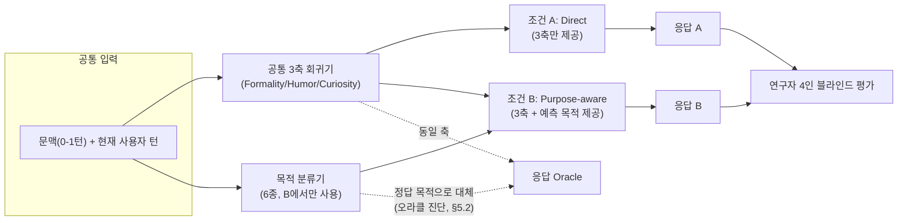
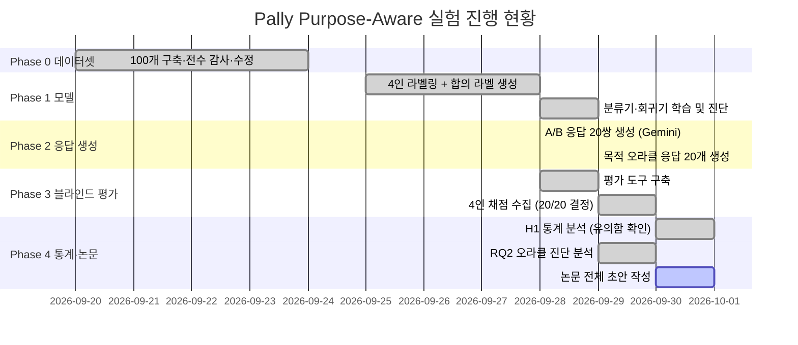

# 명시적 대화 목적을 활용한 Pally의 응답 적합성과 후속 대화 연속성 평가 (초안 v3)

> **작성 상태**: 실험설계·데이터셋·Phase 1(목적 분류기·축 회귀기) 결과와 블라인드 A/B 평가(§5.4, RQ1의 주 결과), 목적 분류기 vs 응답생성기 원인 분리 진단(§5.2, RQ2)까지 모두 확정. 연구자 4인의 최종 판정이 20개 항목 전원 결정됐으며, 조건 B(Purpose-aware)가 조건 A(Direct)보다 통계적으로 유의하게 선호됨을 확인했다(§5.4).

---

## 1. 서론

대규모 언어모델(LLM)의 활용 범위는 대화형 상호작용과 학습 지원 등으로 확장되고 있다. 특히 언어 분야에서는 생성형 AI 챗봇을 상대로 한 회화 학습 연구가 이루어지고 있다[12]. 그러나 자연스러운 회화에 등장하는 비격식 표현(슬랭, 비표준적 구어 표현)의 이해에는 한계가 존재한다. 비격식 표현은 동일한 표현도 문맥에 따라 문자적(literal) 의미와 다른 의미로 사용될 수 있기 때문에 문맥과 의미적 확장을 함께 고려할 필요가 있다[2].

슬랭을 탐지하고 해석하는 방법에 있어 많은 연구가 이루어져왔으나, 탐지만으로 LLM이 비격식 표현에 적절하게 응답하고 사용자의 의도에 따른 맥락을 유지할 수 있는지 판단하는 것에는 한계가 있다. LLM이 아닌 일반적 대화·평가 연구에서도 개별 응답 단위의 의미뿐 아니라 대화 전체 흐름의 일관성과 사용자 발화에 대한 이해를 별도의 평가 요소로 다룬다[7]. 따라서 자연스러운 대화 경험을 지원하기 위해서는 비격식 표현의 의미를 파악하는 것을 넘어, 화자의 의도와 대화 맥락이 응답에 반영되는지 그 여부를 검증할 필요가 있다.

본 연구는 자체 개발한 AI 영어 회화 학습 서비스 Pally를 활용하여 비격식 표현의 이해와 적절한 응답 생성 사이의 연결성에 주목한다. 구체적으로 응답을 생성하기에 앞서 추정한 대화 목적을 명시적 중간표현(intermediate representation)으로 활용하고, 이를 활용하지 않는 조건과 비교하여 응답 품질에 미치는 효과를 검증하고자 한다. 이를 통해 생성된 응답이 발화의 표면적 의미에만 머무르지 않고 화자의 의도에 부합하며, 이후 이어질 대화 맥락과도 양립할 수 있는지를 모델링 차원에서 탐색하고자 한다.

본 연구는 100개 항목 규모의 파일럿(pilot) 연구로 설계됐다. 목적 분류기 자체의 분류 성능 향상을 주된 기여로 주장하지 않으며, 통제된 조건에서 명시적 의사소통 기능 표현이 만드는 증분 효과와 오류 전파 경로를 검증하는 데 초점을 둔다. 결과적으로 본 연구는 이 소규모 파일럿에서도 명시적 목적 결합이 응답 선호도에 통계적으로 유의한 차이를 만든다는 증거를 제시하며(§5.4), 동시에 그 효과가 어디서 비롯되는지 — 목적 분류의 정확도인지, 목적 정보 자체의 존재인지 — 를 진단적으로 분리한다(§5.2).

## 2. 관련연구

표 1은 슬랭 처리, 대화행위 모델링 및 응답 평가의 주요 접근을 비교한다. 대화행위나 계획을 생성 조건으로 사용하는 방법은 이미 제안되었다[5,6]. 본 연구는 중의적·비격식 사용자 발화에서 예측 목적을 세 축 추정과 응답 생성에 함께 추가했을 때 Direct 경로 대비 나타나는 증분 효과에 초점을 둔다.

Mehri와 Eskenazi[7]는 대화 품질을 턴과 전체 대화 수준의 세부 특성으로 평가하였다. 이를 참조하여 의미 해석과 후속 연결을 구분하되, 본 연구의 인간 평가 기준은 별도로 정의한다. 주관적 주석의 관점을 명시해야 한다는 논의[8]와 LLM 제안이 인간 주석에 영향을 줄 수 있다는 연구[9]에 따라, 본 연구는 인간 라벨러가 응답 생성 전에 목적·축·의미·태도 및 응답 채점 기준을 LLM 제안 없이 직접 작성하도록 절차를 설계했다. 또한 CheckList[10]의 행동적 평가 관점에 따라 전체 평균뿐 아니라 실패 유형별 결과(목적 오분류가 응답 오류로 이어지는 경로 등)를 함께 살핀다.

**표 1. 관련 접근 비교**

| 접근 | 대표 연구 | 초점 | 본 연구와의 차이 |
|---|---|---|---|
| 슬랭 탐지·해석 | Pei et al.[1], Sun et al.[2,3] | 표현 단위의 의미 판별 | 의미 판별을 넘어 응답 생성·후속 대화 양립성까지 확장 |
| 대화행위 모델링 | Stolcke et al.[4] | 발화의 기능 태깅 | 6종 목적 범주를 응답 생성 조건으로 직접 사용 |
| 정책/계획 기반 응답 생성 | Hedayatnia et al.[5], Ramirez et al.[6] | 대화행위·계획을 생성 조건화 | 동일 축 예측을 공유한 상태에서 목적 유무만 격리(ablation) |
| 대화 품질 평가 | Mehri & Eskenazi[7] | 턴/전체 수준 자동 평가 | 인간 4인의 사전 정의 rubric 기반 블라인드 평가 |
| 주관적 주석 방법론 | Röttger et al.[8], Schroeder et al.[9] | 주석자 편향·LLM 개입 문제 | 라벨 생성 단계에서 LLM 제안 완전 배제 |
| 행동적 평가 | Ribeiro et al.[10] | 실패 유형별 세분 평가 | 슬라이스(clear/ambiguous-informal/surface-shortcut)별 결과 분리 보고, 목적 오분류·생성기 반영 실패 원인 분리(RQ2) |

## 3. Pally 모델 설명

Pally는 사용자 발화의 스타일 정보를 응답에 활용하는 대화 시스템이다. 본 연구의 실험 경로는 음성 입출력과 장기 대화 이력에서 분리하고, 최소 이전 문맥 0–1턴과 현재 턴을 입력으로 사용한다. Formality는 구어적 존중·체면 고려·격식성, Humor는 지각되는 유희성, Curiosity는 명시적인 정보·설명 요구 강도로 조작화한다. 각 축은 0–100점이며 5점 단위로 반올림한다. Energy와 Intimacy는 음성 및 장기 관계 이력이 없어 이번 실험 범위에서 평가하지 않는다.

Direct 조건(A)은 입력에서 세 축을 직접 예측하여 응답을 생성한다. Purpose-aware 조건(B)은 A와 동일한 공통 축 회귀기가 산출한 동일한 세 축 예측값을 그대로 쓰되, 목적 분류기가 예측한 목적을 응답 생성 단계에만 추가로 결합해 생성기에 제공한다(§4.2). 즉 목적 예측은 축 추정에 관여하지 않는다. 목적은 정보 제공(answer_inform), 설명·탐색(explain_explore), 행동 요청(act_request), 확인·수정(confirm_repair), 인정·공감(acknowledge_empathize), 사회적 화답(social_reciprocate)의 6종이다. 유머는 순환 판단(circular reasoning)을 막기 위해 목적 범주에 넣지 않는다. 두 조건의 생성기와 기본 응답 지침은 같으며 B에만 예측 목적을 추가한다. 목적은 원하는 반응 유형을, 축은 응답 스타일을 안내하되 공격성이나 부적절한 농담의 모방을 요구하지 않는다.

**그림 1. 조건 A/B 파이프라인과 오라클 진단 경로.** A/B는 동일한 3축 예측값을 공유하며, B에만 예측 목적이 추가로 주입된다. 점선은 §5.2의 진단에서만 쓰인 세 번째 경로로, 분류기 예측 대신 정답 목적을 직접 주입해 같은 생성기로 응답을 만든다.

## 4. 실험설계

### 4.1 실험환경과 자료

최종 코퍼스는 AMI Meeting Corpus(CC BY 4.0)[13]와 ICSI Meeting Corpus(CC BY 4.0)[14], Santa Barbara Corpus of Spoken American English(CC BY-ND 3.0)[15]이며, 2026년 9월에 구성했다. 구현 환경은 Python 3.12, scikit-learn 1.9.1, numpy 2.5.3, scipy 1.18.1이다. 생성기는 Gemini 2.5 Flash Lite이다. 입력·출력 언어는 영어, 최대 응답 길이는 약 10–20단어의 한 문장으로 고정했다. 온도는 0으로 설정했다. A/B에는 동일 입력을 제공하며 평가용 후속 발화(continuation probe)는 전달하지 않는다.

자료는 명확한 발화(clear) 30개, 중의적·비격식 발화(ambiguous-informal) 40개, 표면 단서에 따른 오판을 점검하는 발화(surface-shortcut) 30개로 구성했다. clear와 surface-shortcut은 AMI/ICSI에서, ambiguous-informal은 Santa Barbara Corpus에서 추출했다. 학습 80개와 시험 20개를 한 번 분리했으며 시험 슬라이스는 각각 6·8·6개이다. 같은 표현군(lexical family)은 두 분할에 겹치지 않게 했고, family당 최대 2개로 제한했다. 문맥이 부족해 의미를 판단할 수 없는 항목은 전수 감사를 거쳐 학습 전 교체했다(예: 의미 없는 backchannel만 있던 `context_before` 49건 중 38건을 실제 의미 판단이 가능한 문맥으로 교체, 11건은 설계 규정대로 `null` 처리).

**표 2. 데이터셋 구성**

| 슬라이스 | 코퍼스 | 전체 | 학습 | 시험 |
|---|---|---:|---:|---:|
| clear | AMI/ICSI | 30 | 24 | 6 |
| ambiguous-informal | Santa Barbara | 40 | 32 | 8 |
| surface-shortcut | AMI/ICSI | 30 | 24 | 6 |
| **합계** | | **100** | **80** | **20** |

연구자 4인은 LLM 제안 없이 목적·축·의미·태도와 응답의 필수 속성 및 후속 맥락 기준을 작성했다. 목적은 3인 이상 일치 시 확정하고, 나머지는 워크북 결과와 연구 책임자의 판단을 바탕으로 합의 라벨을 생성하되 원시 판단은 보존했다. 축 정답은 4인 중앙값을 5점 단위로 반올림했다.

**표 3. 라벨 신뢰도**

| 대상 | 지표 | 값 |
|---|---|---:|
| 목적(6종) | Fleiss' kappa | 0.311 |
| 목적(6종) | 평균 쌍별 일치율 | 62.5% |
| 목적(6종) | 3인 이상 다수결 확정 비율 | 77/100 |
| Formality | ICC(1,k) | 0.474 |
| Humor | ICC(1,k) | 0.686 |
| Curiosity | ICC(1,k) | 0.835 |

### 4.2 모델

특징은 단어 TF-IDF 1–2gram과 문자 TF-IDF 3–5gram이다. 목적 분류에는 Logistic Regression(C=1, class_weight=balanced, max_iter=2000), 축별 추정에는 Ridge Regression(alpha=1)을 사용한다. 어휘와 IDF는 학습 80개에서만 적합한다. 현 설계에서 조건 B의 응답 생성은 학습 시 인간 목적, 시험 시 예측 목적을 사용하며, 이 입력 차이로 인한 오류 가능성은 분석상의 제약으로 별도 구분한다.

### 4.3 연구 질문

RQ1은 조건 B(Purpose-aware)가 조건 A(Direct)보다 적합한 응답을 더 많이 생성하는지 묻는다. RQ2는 조건 B의 실패가 (a) 목적 분류기의 오분류 때문인지 (b) 응답 생성기가 올바른 목적 신호조차 반영하지 않기 때문인지를 분리해 묻는다. 슬라이스별 개선 폭 비교는 탐색적으로 해석한다.

### 4.4 응답 평가와 분석 절차

시험 항목마다 A/B 응답을 하나씩 생성하여 총 20쌍을 평가한다. 연구자 4인에게 조건과 중간 예측(목적·축)을 숨긴 X/Y 응답을 평가자·항목별로 무작위화한 순서로 제시하고 채점한다. 의미·태도 보존, 목적 충족, 스타일 적절성, 대화 연속성, 관련성·자연스러움을 각각 1–5점으로 평가한다. 중대한 의미 오류가 없고 의미·태도 점수가 4점 이상이며 나머지가 각각 3점 이상이면 좋은 응답으로 판정한다.

한쪽만 통과하면 해당 조건의 승리, 모두 실패하면 '둘 다 부적합'으로 판정한다. 둘 다 통과하면 총점 차이 3점 이상인 조건이 승리하며 그 외는 동률이다. 3인 이상 일치한 판정을 항목 결과로 삼고 나머지는 판정 불일치로 보존한다. 최종 20개 항목은 연구자 4인이 서로의 판정을 보지 않은 상태에서 각자 독립적으로 채점했고, 그 결과를 사후에 취합해 항목별 최종 판정을 확정했다.

통계 단위는 평가자 수를 곱한 80개가 아니라 시험 항목 20개이다[11]. 승패가 결정된 항목에는 exact sign test와 조건부 B 승률의 Wilson 95% 신뢰구간을 적용하고, 전체 20개의 승패·동률·둘 다 부적합·불일치 분포를 보고한다. 목적 macro-F1, 축별 MAE·Spearman 상관 및 합의 전 평가자 일치도를 함께 보고한다.

### 4.5 목적 오라클 진단 (RQ2)

RQ2에 답하기 위해 세 번째 응답 생성 경로를 추가했다. 시험 20개 각각에 대해, 분류기의 예측 목적 대신 정답(인간 라벨) 목적을 그대로 주입해 조건 B와 동일한 생성기·프롬프트 틀·온도(0)로 응답을 생성한다("오라클" 응답). 분류기가 틀린 항목에 한해 오라클 응답과 조건 B 응답을 정확히 문자열 비교한다. 온도가 0이므로, 두 응답이 완전히 동일하다면 정답 목적을 줘도 생성기가 그 신호를 응답에 전혀 반영하지 않았다는 직접적 증거가 된다. 반대로 응답이 다르다면 목적 신호가 생성 결과에 실제로 영향을 미쳤다는 뜻이다. 이 비교는 목적 신호의 생성 영향 여부만을 판단하며, 어느 쪽 응답이 더 우수한지는 판단하지 않는다.

## 5. 실험결과

### 5.1 목적 분류기·축 회귀기

학습 80개로 적합한 목적 분류기를 시험 20개에 held-out 평가한 정확도는 45%로, 다수 클래스만 예측하는 기준선(55%)보다 낮았다. Confusion matrix상 다수 클래스(acknowledge_empathize) 외 5개 목적은 전혀 맞히지 못했다.

**표 4. 목적 범주별 분포 (전체 100개, 학습 80개 fit에 그대로 반영됨)**

| 목적 | 전체 100개 중 개수 |
|---|---:|
| acknowledge_empathize | 50 |
| confirm_repair | 16 |
| social_reciprocate | 15 |
| explain_explore | 10 |
| act_request | 6 |
| answer_inform | 3 |

원인을 분리하기 위해 Leave-One-Out 교차검증으로 4개 모델(Logistic Regression, Multinomial Naive Bayes, kNN k=1/k=3)을 비교했다.

**표 5. Leave-One-Out 교차검증 비교 (학습 80개)**

| 모델 | 정확도 | macro-F1 |
|---|---:|---:|
| Logistic Regression (본 설계) | 45.0% | 0.190 |
| Multinomial Naive Bayes | 48.8% | 0.109 |
| kNN (k=1, cosine) | 37.5% | 0.239 |
| kNN (k=3, cosine) | 47.5% | 0.232 |
| 기준선(다수 클래스만 예측) | 48.8% | – |

네 모델 모두 기준선 근처이거나 이하였다. 이는 모델 선택의 문제라기보다, 6종 목적으로 분할했을 때 일부 범주(특히 answer_inform 3개)의 학습 표본이 근본적으로 부족한 데서 기인한 것으로 판단한다. 목적 라벨 자체의 평가자 간 신뢰도(Fleiss' kappa 0.311, 표 3)도 분류기 정확도의 상한을 제약하는 요인으로 함께 작용했을 수 있다.

**라벨러 민감도 분석.** 위 45%는 4인 합의 라벨을 정답으로 삼은 수치다. 별도로, 연구자 1인이 100개 전체를 처음부터 끝까지 혼자 라벨링한 내부적으로 일관된 라벨셋을 대안 정답으로 삼아 같은(이미 배포된) 분류기를 재평가했더니 시험 20개 중 13개(65%)를 맞혀 기준선(55%)을 상회했다. 두 수치의 차이는 분류기 자체가 바뀐 것이 아니라 정답으로 쓰인 라벨셋이 다르기 때문이며, 목적 라벨의 평가자 간 신뢰도가 충분히 확보되지 않은 상태에서는 "정확도"라는 단일 수치 자체가 어떤 라벨셋을 기준으로 삼느냐에 따라 민감하게 달라질 수 있음을 보여준다. 두 수치 모두 논문에 투명하게 병기하며, 어느 한쪽만을 대표값으로 취하지 않는다.

이 결과에 따라 본 연구는 목적 분류기의 판별 성능 자체를 주된 기여로 주장하지 않으며, 현재 구현된 목적 예측 파이프라인을 고정한 상태에서 그것이 최종 응답 품질에 주는 영향(RQ1)과, 그 실패가 분류기와 생성기 중 어디에서 비롯되는지(RQ2, §5.2)를 별도로 검증하는 방향으로 결과 해석 범위를 좁힌다.

### 5.2 RQ2 — 분류기 오분류 vs 생성기의 목적 미반영

§4.5의 오라클 진단을 §5.1의 라벨러 민감도 분석에서 쓴 대안 정답 라벨셋 기준으로 적용했다. 이 진단이 보여주는 것은 **목적 신호가 생성 결과에 인과적으로 영향을 미치는지 여부**이며, 어느 쪽 응답이 더 낫다는 품질 판단은 아니다 — 응답 품질 자체에 대한 판단은 §5.4의 블라인드 평가로만 내린다. 시험 20개를 세 갈래로 나눈 결과는 다음과 같다.

**표 6. RQ2 진단 결과 (시험 20개) — 목적 신호의 생성 영향 여부**

| 분류 | 개수 | 비율 | 의미 |
|---|---:|---:|---|
| 분류기 정답 | 13 | 65% | 예측 목적이 정답과 일치. 이 항목들의 응답 품질이 실제로 좋다는 뜻은 아니며, 목적 외 다른 요인에 의한 품질 저하는 이 진단으로 확인되지 않는다 |
| 분류기 오분류, 오라클 대체 시 응답 텍스트 변화 | 6 | 30% | 예측 목적은 틀렸고, 정답 목적으로 바꿔 넣자 생성 텍스트가 실제로 달라짐 — 목적 신호가 생성에 인과적 영향을 미친다는 증거 |
| 분류기 오분류, 오라클 대체해도 응답 텍스트 동일 | 1 | 5% | 예측 목적은 틀렸지만, 정답 목적을 줘도 응답이 문자 그대로 동일함(온도 0) — 이 항목에서는 목적 신호가 생성에 영향을 주지 못함 |

분류기가 틀린 7개 항목 중 6개는 정답 목적으로 바꿔 넣었을 때 생성 텍스트가 달라졌다 — 목적 신호 자체는 생성기 출력에 실제로 영향을 미친다는 뜻이다. 다만 텍스트가 달라졌다는 사실이 그 대체 응답이 더 우수하다는 것을 의미하지는 않으며, 텍스트가 동일했던 1개 항목을 제외한 나머지가 모두 "분류기 문제"라고 단정할 수도 없다 — 분류기가 맞힌 13개 항목 중에도 목적과 무관한 이유로 품질이 낮은 응답이 있을 수 있고, 이는 이 진단의 범위 밖이다. 정성적 사례로, 행동 요청 성격의 발화에 대해 조건 B는 "다들 편하게 얘기해줘서 좋다"는 식의 승인성 논평으로 응답했으나(목적 오분류), 정답 목적(행동 요청)을 준 오라클 응답은 실제로 요청된 행동을 수행하는 응답("네, 저에 대해 조금 더 얘기해드릴게요")을 생성했다 — 목적 정보가 정확히 주어졌을 때 생성기가 이를 응답 형식에 반영한 사례다. 이 사례가 나머지 5개에도 일반화된다고 주장하지는 않는다.

### 5.3 축 회귀기

Formality·Humor·Curiosity 3축의 평가자 간 신뢰도는 표 3과 같다. Curiosity(ICC=0.835)는 비교적 안정적으로 채점된 반면 Formality(ICC=0.474)는 편차가 가장 컸다.

### 5.4 블라인드 A/B 평가 (RQ1)

최종시험 20쌍에 대한 조건 A/B 블라인드 평가를 §4.4의 절차대로 연구자 4인이 진행했다. 평가자에게는 조건과 중간 예측을 숨긴 X/Y 형태로 응답을 제시했으며, 어느 라벨이 어느 조건에 대응하는지는 연구자 본인 외에는 채점 시점에 공개되지 않았다. 20개 항목 전원에 대해 최종 판정이 결정됐다(동률·판정 불일치 없음).

**표 7. 항목별 최종 판정 (20개, 전원 결정)**

| 항목 ID | 승자 | 항목 ID | 승자 |
|---|:---:|---|:---:|
| pally100_034 | B | pally100_090 | B |
| pally100_081 | B | pally100_091 | A |
| pally100_082 | B | pally100_092 | B |
| pally100_083 | B | pally100_093 | B |
| pally100_084 | B | pally100_094 | B |
| pally100_085 | B | pally100_095 | A |
| pally100_086 | A | pally100_096 | B |
| pally100_087 | B | pally100_097 | A |
| pally100_089 | B | pally100_098 | B |
| pally100_100 | B | pally100_099 | A |

**표 8. H1 — exact sign test 및 Wilson CI**

| 지표 | 값 |
|---|---:|
| 승패 결정 항목 수(n_decided) | 20/20 |
| B 승 | 15 |
| A 승 | 5 |
| B 조건부 승률 | 75.0% (15/20) |
| Wilson 95% 신뢰구간 | [53.1%, 88.8%] |
| exact two-sided binomial p-value | 0.0414 |
| 판정 | α=0.05 기준 통계적으로 유의함 |

이번 파일럿에서 조건 B(Purpose-aware)는 조건 A(Direct)보다 통계적으로 유의하게 선호됐다(p=0.0414 < 0.05). Wilson 95% CI [53.1%, 88.8%]는 0.5를 포함하지 않는다. §5.1–5.2의 진단 결과와 함께 읽으면, 목적 분류기의 정확도가 기준선 수준(45–65%, 라벨셋에 따라 다름)에 머무르는 상태에서도 목적 정보를 응답 생성에 추가하는 것 자체가 사람이 지각하는 응답 적합성을 유의하게 끌어올린다는 뜻으로 해석할 수 있다.

## 6. 결론 및 기여

본 연구는 슬랭 해석의 평가 범위를 의미 선택에서 적절한 응답과 후속 맥락의 유지까지 확장하고, Pally에서 명시적 목적을 추가한 결합 경로의 증분 효과를 평가하는 절차를 제시한다. 목적 오분류·응답 오류를 연결하여 원인을 분리하는 진단적 분석도 연구 범위에 포함한다.

100개 규모의 파일럿 표본에서 6종 목적 분류기는 공식 합의 라벨 기준 다수 클래스 기준선을 넘지 못했으나(45% vs 55%, §5.1), 대안 라벨셋 기준으로는 기준선을 상회했다(65%). 이 구조적 한계에도 불구하고, 블라인드 A/B 평가(§5.4)에서 조건 B(Purpose-aware)는 조건 A(Direct)보다 통계적으로 유의하게 선호됐다(15/20, 75.0%, Wilson 95% CI [53.1%, 88.8%], exact binomial p=0.0414). 즉 목적 분류기의 정확도 자체는 개선 여지가 크지만, 현재 정확도 수준에서도 목적 정보를 응답 생성 경로에 추가하는 것은 사람이 체감하는 응답 적합성을 유의하게 높였다.

RQ2 진단(§5.2)은 목적 신호가 생성 결과에 실제로 영향을 미치는지를 보여준다. 분류기가 틀린 항목의 대다수(6/7)에서 정답 목적으로 바꿔 넣자 응답 텍스트가 실제로 달라졌고, 생성기가 정답 목적을 줘도 텍스트가 전혀 바뀌지 않은 경우는 1개(전체의 5%)뿐이었다. 이는 목적 신호 자체가 생성기에 무시되지 않고 실제로 작동한다는 근거이며, 분류기 정확도를 높이는 것이 조건 B의 유력한 개선 경로 중 하나임을 시사한다 — 다만 이 진단만으로 응답 품질 저하의 원인을 전부 규명했다고 주장하지는 않는다. 특히 학습 표본이 3개에 불과한 answer_inform과 같은 소수 범주의 데이터 확충이 우선순위가 높다.

이에 따라 본 연구의 기여를 다음 세 갈래로 정리한다. (1) **실증적 기여**: 100개 규모의 통제된 파일럿에서도 명시적 목적 결합이 응답 선호도에 통계적으로 유의한 차이를 만든다는 증거를 제시했다. (2) **진단적 기여**: 목적 오라클 치환이라는 절차로 목적 신호가 생성 결과에 실제로 영향을 미치는지를 항목별로 검증했고, 이번 파일럿에서는 분류기가 틀린 항목 대부분(6/7)에서 목적 신호가 응답을 실제로 바꾼다는 것을 확인했다 — 이는 응답 품질 저하의 전체 원인을 규명한 것은 아니며, 목적 신호가 생성기에서 무시되지 않는다는 것을 보여주는 진단이다. (3) **방법론적 기여**: 목적 예측을 응답 생성에 결합하는 조건화 파이프라인, 이를 격리해 비교하는 블라인드 평가 절차, 그리고 라벨셋 선택이 분류기 정확도 수치에 미치는 민감도를 투명하게 기록하는 보고 방식을 검증 가능한 형태로 구축했다.

한계도 분명하다. 시험 20개와 내부 연구자 평가에 따른 일반화 제약이 있으며, 목적의 학습·시험 입력 불일치(학습 시 인간 목적, 시험 시 예측 목적, §4.2)도 남는다. 목적 라벨 자체의 평가자 간 신뢰도가 아직 충분하지 않다(Fleiss' kappa 0.311, §4.1 표 3). 단계별 제거 실험이 없어 축 추정과 생성 단계의 개별 기여를 완전히 분리할 수는 없다. 후속 연구에서는 소수 목적 범주의 표본을 확충해 분류기 정확도를 개선하고, 외부 평가자·더 큰 표본·새 시험 자료·실제 다중 턴 대화로 재검증할 필요가 있다. 본 평가만으로 사용자 만족도나 대화 지속 시간의 향상을 주장하지 않는다.

## 참고문헌

[1] Z. Pei, Z. Sun, and Y. Xu. "Slang Detection and Identification." CoNLL, pp. 881–889, 2019.
[2] Z. Sun, R. Zemel, and Y. Xu. "Semantically Informed Slang Interpretation." NAACL, pp. 5213–5231, 2022.
[3] Z. Sun, Q. Hu, R. Gupta, R. Zemel, and Y. Xu. "Toward Informal Language Processing: Knowledge of Slang in Large Language Models." NAACL, pp. 1683–1701, 2024.
[4] A. Stolcke et al. "Dialogue Act Modeling for Automatic Tagging and Recognition of Conversational Speech." Computational Linguistics, 26(3), pp. 339–374, 2000.
[5] B. Hedayatnia et al. "Policy-Driven Neural Response Generation for Knowledge-Grounded Dialog Systems." INLG, pp. 412–421, 2020.
[6] A. Ramirez et al. "Controllable Generation of Dialogue Acts for Dialogue Systems via Few-Shot Response Generation and Ranking." SIGDIAL, pp. 355–369, 2023.
[7] S. Mehri and M. Eskenazi. "Unsupervised Evaluation of Interactive Dialog with DialoGPT." SIGDIAL, pp. 225–235, 2020.
[8] P. Röttger et al. "Two Contrasting Data Annotation Paradigms for Subjective NLP Tasks." NAACL, pp. 175–190, 2022.
[9] H. Schroeder, D. Roy, and J. Kabbara. "Just Put a Human in the Loop? Investigating LLM-Assisted Annotation for Subjective Tasks." Findings of ACL, pp. 25771–25795, 2025.
[10] M. T. Ribeiro et al. "Beyond Accuracy: Behavioral Testing of NLP Models with CheckList." ACL, pp. 4902–4912, 2020.
[11] R. Dror et al. "The Hitchhiker's Guide to Testing Statistical Significance in Natural Language Processing." ACL, pp. 1383–1392, 2018.
[12] (회화 학습 챗봇 관련 인용 — 원 초안의 출처 확인 필요, 서지정보 보완 요망)

## 참고 데이터셋

본 연구가 100개 항목을 구성하는 데 사용한 원천 코퍼스는 다음과 같다. 세 코퍼스 모두 대화 turn 후보를 추출하는 원천으로만 사용했으며, 코퍼스 자체를 그대로 배포하거나 재가공물을 공개하지 않는다(§4.1, 표 2).

**표 9. 사용 코퍼스**

| 코퍼스 | 인용 | 라이선스 | 접근 방식 | 본 연구에서의 용도 |
|---|---|---|---|---|
| AMI Meeting Corpus | [13] | CC BY 4.0 | 공개 다운로드 | clear·surface-shortcut 슬라이스 후보 추출 |
| ICSI Meeting Corpus | [14] | CC BY 4.0 | 공개 다운로드 | clear·surface-shortcut 슬라이스 후보 추출 |
| Santa Barbara Corpus of Spoken American English | [15] | CC BY-ND 3.0 | 공개 다운로드(가입 불필요) | ambiguous-informal 슬라이스 후보 추출 |

[13] J. Carletta et al. "The AMI Meeting Corpus: A Pre-announcement." Proc. MLMI, pp. 28–39, 2005. (CC BY 4.0)
[14] A. Janin et al. "The ICSI Meeting Corpus." Proc. ICASSP, pp. 364–367, 2003. (CC BY 4.0)
[15] J. W. Du Bois, W. L. Chafe, C. Meyer, S. A. Thompson, R. Englebretson, and N. Martey. "Santa Barbara Corpus of Spoken American English." Linguistic Data Consortium, Philadelphia, 2000–2005. (CC BY-ND 3.0)

---

## 부록: 실험 로드맵

**그림 2. 실험 로드맵.**
